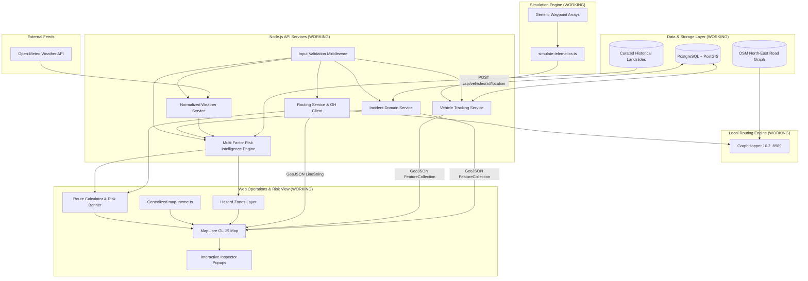

# System Architecture

This document describes the high-level architecture and current engineering implementation status for **SauraRoute** (SIH26002).

---

## 1. Implementation Status Matrix

| Component / Layer | Location | Purpose | Actual Status |
| :--- | :--- | :--- | :--- |
| **API Server & Health** | `services/api` | Node.js Express + TypeScript backend with health endpoint and database check. | **WORKING** |
| **PostGIS Migrations & Seeds** | `services/api/src/db` | Migrations for PostGIS, `vehicles`, `incidents`, and `historical_landslides` with GIST indexes and seed runner (`npm run db:seed`). | **WORKING** |
| **Weather Integration** | `services/api/src/services` | Normalized weather abstraction for Open-Meteo with input validation (`GET /api/weather`). | **WORKING** |
| **Incident Management API** | `services/api/src/controllers` | Incident lifecycle (`REPORTED`, `VERIFIED`, `ACTIVE`, `RESOLVED`, `REJECTED`) and GeoJSON endpoints. | **WORKING** |
| **Vehicle Tracking API** | `services/api/src/controllers` | Real-time GPS coordinate telemetry updates and GeoJSON fleet listing. | **WORKING** |
| **Telemetry Simulator** | `services/api/src/scripts` | Generic waypoint-driven GPS simulation engine (`simulate-telematics.ts`). | **WORKING** |
| **GraphHopper Routing Service** | `services/routing` | Local GraphHopper 10.2 engine running on Java 17 with North-East India OSM road network. | **WORKING** |
| **Routing API Endpoint** | `services/api/src/controllers` | `GET /api/routes` with coordinate validation, normalization, and error handling. | **WORKING** |
| **Risk Intelligence Engine** | `services/api/src/services` | Multi-factor risk engine (`risk.service.ts`) computing weighted score $[0, 100]$ from Weather ($35\%$) + Slope ($25\%$) + Incidents ($25\%$) + Historical Hotspots ($15\%$), route sampling, and `/api/risk/*` endpoints. | **WORKING** |
| **Interactive Map Dashboard** | `apps/web` | React + MapLibre GL JS rendering live hazard markers, vehicles, route LineStrings, corridor risk indicator banner, and toggleable hazard zone overlays. | **WORKING** |
| **DEM & Slope Engine** | `services/ml` | Python DEM processor (`dem_processor.py`) calculating slope angles from elevation arrays, verified by `test_slope.py`. | **WORKING** |
| **Terrain & Landslide ML Classifier** | `services/ml` | Supervised Random Forest model trained on 40 balanced samples (20 historical + 20 baseline controls), 5-fold CV ($100\%$ acc), and `/api/ml/*` endpoints. | **WORKING** |
| **Automated Test Suite** | `services/api/src/tests` & `services/ml/src/` | 50 automated tests (42 backend tests + 8 Python ML unit tests) covering validation, lifecycle, routing, risk scoring, and ML classifiers. | **WORKING** |
| **Risk-Aware Dynamic Rerouting** | `services/routing` | Dynamic hazard avoidance using GraphHopper Custom Models with real-time risk overlays. | **PLANNED** (Step 8) |
| **Mobile Field App** | `apps/mobile` | Offline-capable Leaflet mobile app for incident reporting and hazard alerts. | **PLANNED** (Step 9) |

---

## 2. Conceptual Architecture Flow (Step 6 Milestone)

