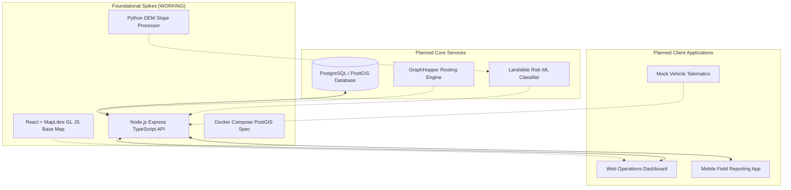

# System Architecture

This document describes the high-level architecture and current engineering implementation status for **SauraRoute** (SIH26002).

---

## 1. Implementation Status Matrix

| Component / Layer | Location | Purpose | Actual Status |
| :--- | :--- | :--- | :--- |
| **API Server Foundation** | `services/api` | Node.js Express + TypeScript backend with health endpoint and database check. | **WORKING** |
| **Database Scaffolding** | `docker-compose.yml` | PostGIS (PostgreSQL 15 + PostGIS 3.3) container configuration and `.env` setup. | **WORKING** |
| **GIS Map Base View** | `apps/web` | React + Vite + TypeScript web application with MapLibre GL JS centered on the NER (`[93.5, 26.0]`). | **WORKING** |
| **DEM & Slope Engine** | `services/ml` | Python DEM processor (`dem_processor.py`) calculating slope angles from elevation arrays, verified by `test_slope.py`. | **WORKING** |
| **Routing Architecture Spike** | `docs/routing-spike.md` | Specification for OSM PBF bounding-box clipping and GraphHopper Custom Model integration. | **IN PROGRESS** (Documented) |
| **PostGIS Domain Schema** | `services/api/src/db` | Relational tables for Users, Vehicles, Incidents, and Road Segments. | **PLANNED** |
| **GraphHopper Service** | Container / Local | Active local routing container serving shortest and risk-penalized paths. | **PLANNED** |
| **Landslide ML Classifier** | `services/ml` | Supervised model (Random Forest/XGBoost) trained on GSI/NASA events + Open-Meteo historical rainfall. | **PLANNED** |
| **Operations Dashboard UI** | `apps/web` | Fleet tracking, incident management, and hazard overlay dashboard. | **PLANNED** |
| **Mobile Field App** | `apps/mobile` | Offline-capable Leaflet mobile app for incident reporting and hazard alerts. | **PLANNED** |
| **Mock Telematics Simulator** | `services/api` or `services/ml` | Background GPS feed simulation generating mock vehicle coordinates. | **PLANNED** |

---

## 2. Conceptual Architecture Flow

---

## 3. Core Infrastructure Specifications

### 1. Database (PostGIS)
* **Status:** WORKING configuration (`docker-compose.yml`, `.env`), PLANNED domain tables.
* **Engine:** PostgreSQL 15 + PostGIS 3.3.
* **Role:** Geospatial query execution (finding road segments near vehicles, bounding-box searches for incidents).

### 2. Node.js API Service
* **Status:** WORKING server structure with `GET /api/health` responding.
* **Stack:** Node.js, Express, TypeScript, `pg` driver, `cors`, `dotenv`.

### 3. Python ML / Geospatial Engine
* **Status:** WORKING DEM slope computation engine with automated mathematical gradient verification.
* **Stack:** Python 3.12, NumPy, SciPy, Rasterio.

### 4. Web Application
* **Status:** WORKING MapLibre GL JS integration centered on the NER.
* **Stack:** React 19, TypeScript, Vite, MapLibre GL.
