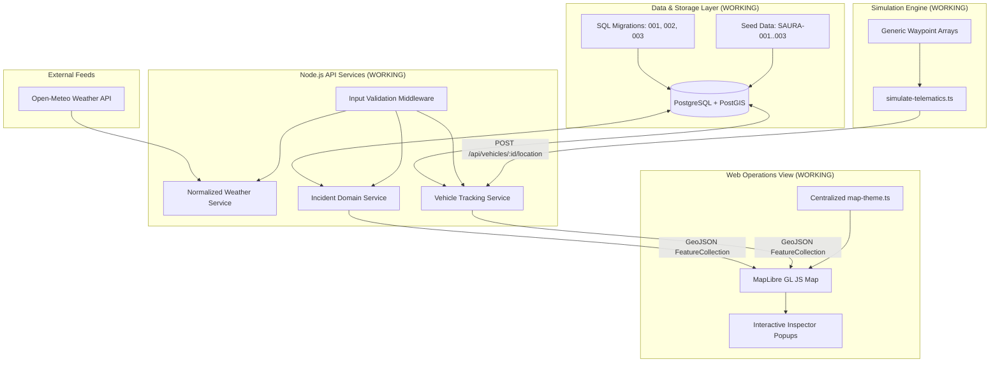

# System Architecture

This document describes the high-level architecture and current engineering implementation status for **SauraRoute** (SIH26002).

---

## 1. Implementation Status Matrix

| Component / Layer | Location | Purpose | Actual Status |
| :--- | :--- | :--- | :--- |
| **API Server & Health** | `services/api` | Node.js Express + TypeScript backend with health endpoint and database check. | **WORKING** |
| **PostGIS Migrations & Seeds** | `services/api/src/db` | Migrations for PostGIS, `vehicles`, and `incidents` with GIST indexes and seed runner (`npm run db:seed`). | **WORKING** |
| **Weather Integration** | `services/api/src/services` | Normalized weather abstraction for Open-Meteo with input validation (`GET /api/weather`). | **WORKING** |
| **Incident Management API** | `services/api/src/controllers` | Incident lifecycle (`REPORTED`, `VERIFIED`, `ACTIVE`, `RESOLVED`, `REJECTED`) and GeoJSON endpoints. | **WORKING** |
| **Vehicle Tracking API** | `services/api/src/controllers` | Real-time GPS coordinate telemetry updates and GeoJSON fleet listing. | **WORKING** |
| **Telemetry Simulator** | `services/api/src/scripts` | Generic waypoint-driven GPS simulation engine (`simulate-telematics.ts`). | **WORKING** |
| **Interactive Map Dashboard** | `apps/web` | React + MapLibre GL JS rendering live GeoJSON hazard and vehicle markers with 3s polling. | **WORKING** |
| **DEM & Slope Engine** | `services/ml` | Python DEM processor (`dem_processor.py`) calculating slope angles from elevation arrays, verified by `test_slope.py`. | **WORKING** |
| **Automated Test Suite** | `services/api/src/tests` | Automated test suite validating coordinates, lifecycle rules, GeoJSON formats, and weather lookups. | **WORKING** |
| **Routing Architecture Spike** | `docs/routing-spike.md` | Specification for OSM PBF bounding-box clipping and GraphHopper Custom Model integration. | **IN PROGRESS** (Documented) |
| **GraphHopper Routing Service** | Container / Local | Active local routing container serving shortest and risk-penalized paths. | **PLANNED** (Step 5) |
| **Terrain & Landslide ML Model** | `services/ml` | Supervised model (Random Forest/XGBoost) trained on GSI/NASA events + Open-Meteo historical rainfall. | **PLANNED** (Step 7) |
| **Full Operations Dashboard UI** | `apps/web` | Extended metrics, filters, and analytics console. | **PLANNED** (Step 9) |
| **Mobile Field App** | `apps/mobile` | Offline-capable Leaflet mobile app for incident reporting and hazard alerts. | **PLANNED** (Step 9) |

---

## 2. Conceptual Architecture Flow (Step 4 Milestone)

