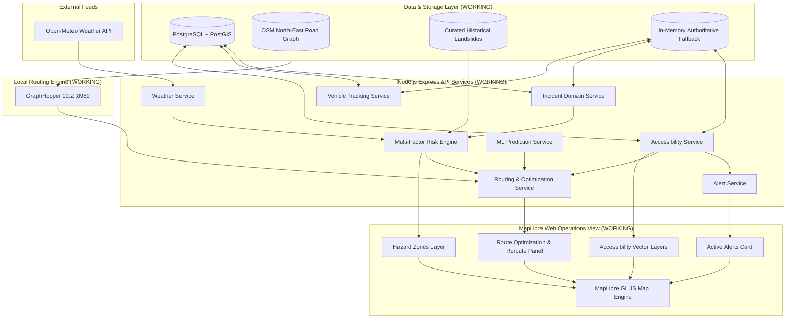

# System Architecture

This document describes the high-level architecture and current engineering implementation status for **SauraRoute** (SIH26002).

---

## 1. Implementation Status Matrix

| Component / Layer | Location | Purpose | Actual Status |
| :--- | :--- | :--- | :--- |
| **API Server & Health** | `services/api` | Node.js Express + TypeScript backend with health endpoint and database check. | **WORKING** |
| **PostGIS Migrations & Seeds** | `services/api/src/db` | Migrations for PostGIS, `vehicles`, `incidents`, `historical_landslides`, and `road_accessibility` with GIST indexes and seed runner (`npm run db:seed`). | **WORKING** |
| **Weather Integration** | `services/api/src/services` | Normalized weather abstraction for Open-Meteo with input validation (`GET /api/weather`). | **WORKING** |
| **Incident Management API** | `services/api/src/controllers` | Incident lifecycle (`REPORTED`, `VERIFIED`, `ACTIVE`, `RESOLVED`, `REJECTED`) and GeoJSON endpoints. | **WORKING** |
| **Vehicle Tracking API** | `services/api/src/controllers` | Real-time GPS coordinate telemetry updates and GeoJSON fleet listing. | **WORKING** |
| **Telemetry Simulator** | `services/api/src/scripts` | Generic waypoint-driven GPS simulation engine (`simulate-telematics.ts`). | **WORKING** |
| **GraphHopper Routing Service** | `services/routing` | Local GraphHopper 10.2 engine running on Java 17 with North-East India OSM road network. | **WORKING** |
| **Routing API Endpoint** | `services/api/src/controllers` | `GET /api/routes` with coordinate validation, normalization, and error handling. | **WORKING** |
| **Risk Intelligence Engine** | `services/api/src/services` | Multi-factor risk engine (`risk.service.ts`) computing weighted score $[0, 100]$ from Weather ($35\%$) + Slope ($25\%$) + Incidents ($25\%$) + Historical Hotspots ($15\%$), route sampling, and `/api/risk/*` endpoints. | **WORKING** |
| **Terrain & Landslide ML Classifier** | `services/ml` | Supervised Random Forest model trained on 40 balanced samples (20 historical + 20 baseline controls), 5-fold CV ($100\%$ acc), and `/api/ml/*` endpoints. | **WORKING** |
| **Hazard-Aware Route Optimization** | `services/api` | Candidate-route optimization: profiles multiple GraphHopper candidate routes with the Step-6 risk engine and deterministically selects the safest route within a 1.35× detour cap (`POST /api/routes/optimize`). GraphHopper edge weights are not modified. | **WORKING** (Step 8) |
| **Dynamic Reroute Evaluation** | `services/api` | Evaluates whether the current route warrants rerouting against freshly profiled candidates and returns a deterministic recommendation (`POST /api/routes/reroute`). | **WORKING** (Step 8) |
| **Road Accessibility Intelligence** | `services/api` | Road accessibility corridor tracking (`OPEN`, `RESTRICTED`, `CLOSED`) with PostGIS persistence, in-memory fallback, and closure-aware route candidate filtering (`/api/accessibility/*`). | **WORKING** (Step 9) |
| **Active-Route Alert Engine** | `services/api` | Deterministic on-read generation of `ROAD_CLOSURE` (CRITICAL) and `ROAD_RESTRICTION` (WARNING) alerts from corridor states (`GET /api/alerts`). | **WORKING** (Step 9) |
| **Interactive Map Dashboard** | `apps/web` | React + MapLibre GL JS rendering live hazard markers, vehicles, route LineStrings, accessibility corridor layers (green/amber/red), active alert HUD, and route optimization/reroute comparisons. | **WORKING** |
| **Automated Test Suite** | `services/api/src/tests` & `services/ml/src/` | 107 automated backend tests (54 API integration + 13 routing optimization + 40 accessibility/alerts) + 8 Python ML unit tests covering validation, routing, risk scoring, ML inference, and accessibility. | **WORKING** |
| **Mobile Field App** | `apps/mobile` | Offline-capable mobile app for field reporting and driver alerts. | **PLANNED** (Later step) |

---

## 2. Architecture & Data Flow

---

## 3. Key Architectural Boundaries & Conventions

1. **Routing & Optimization (Step 8 & 9):**
   * GraphHopper generates alternative candidate road geometries (`algorithm=alternative_route`).
   * SauraRoute does **not** dynamically modify GraphHopper edge weights or alter the OSM road graph at runtime.
   * Accessibility filtering runs first: candidate paths intersecting `CLOSED` corridors within the 250m tolerance are pruned from selection if viable alternatives exist.
   * Multi-factor risk evaluation ($[0, 100]$ score) and ML landslide susceptibility run on remaining eligible candidates.
   * The deterministic selector chooses the safest route within the $1.35\times$ detour constraint and generates an explainable reason.

2. **Road Accessibility & Proximity Detection (Step 9):**
   * Corridors follow the lifecycle: `OPEN` $\leftrightarrow$ `RESTRICTED` $\leftrightarrow$ `CLOSED` (self-transitions prohibited).
   * Geometric proximity is computed using a deterministic, dependency-free equirectangular point-to-segment distance algorithm with a 250m tolerance threshold.
   * Alerts are derived on read from corridor state (`CLOSED` $\rightarrow$ `CRITICAL`, `RESTRICTED` $\rightarrow$ `WARNING`); no push messaging or notification queues are used.

3. **Coordinate Standard:**
   * All GeoJSON payloads strictly use RFC 7946 `[longitude, latitude]` array ordering.
   * REST API request bodies accept named `{ latitude, longitude }` objects to prevent parameter transposition.
