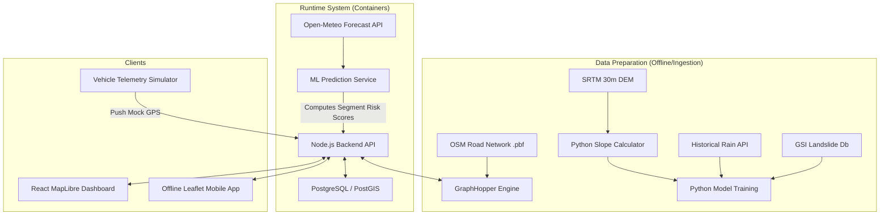

# Data Research Report

This document compiles the data discovery, GIS evaluations, and machine learning feasibility studies conducted for **SauraRoute** (SIH26002).

---

## 1. Executive Summary
To build an AI-based logistics and accessibility intelligence platform for the North Eastern Region (NER), we evaluated public and government data sources across geography, meteorology, road connectivity, and disaster history. We discovered that while high-quality static geographical data (elevations, road structures, historical incident lists) and weather forecast APIs are readily accessible, real-time government databases for active road blockages or logistics GPS telematics are not publicly available. 

Therefore, SauraRoute must combine **real open datasets** for terrain and weather forecasting with an **active mobile crowd-sourcing/field reporting network** and a **telematics simulator** to successfully demonstrate logistics optimization and AI landslide risk forecasting in our prototype.

---

## 2. Best Available Data Sources

### A. Best Available Road Data: OpenStreetMap (OSM) via Geofabrik
* **Details:** OSM provides excellent vector-based highway centerlines, names, bridges, tunnels, and network topologies for major NER routes (NH-2, NH-37, etc.).
* **Licensing:** Open Database License (ODbL). Requires attribution to OSM contributors.
* **Access Method:** Download `.osm.pbf` files for India/NER directly from Geofabrik.

### B. Best Weather Data: Open-Meteo API
* **Details:** Offers free, high-resolution (9-11km) meteorological outputs (precipitation, forecast rain, soil temperature). Features both 7-day hourly forecasts and historical database lookups back to 1940.
* **Licensing:** CC BY 4.0. Free for non-commercial student prototypes (up to 10k daily requests).
* **Access Method:** Free REST API (no registration or API key required).

### C. Best Terrain Data: USGS SRTM 30m Digital Elevation Model
* **Details:** 30-meter spatial resolution elevations covering the entire NER. Suitable for calculating slope gradients using geospatial libraries.
* **Licensing:** Public Domain.
* **Access Method:** Free download from USGS EarthExplorer.

### D. Best Incident Data: GSI Landslide Inventory & NASA Global Landslide Catalog
* **Details:** Historical catalogs containing coordinates, dates, and triggers for thousands of landslides in India (with deep coverage in Assam, Sikkim, and other NER states).
* **Licensing:** CC BY 4.0 (GSI processed via Bharatlas) / Public Domain (NASA).
* **Access Method:** Direct GeoJSON/CSV download.

### E. Best Administrative Boundary Data: Data{Meet} Community Maps
* **Details:** Clear, pre-converted, and community-validated boundary maps for India states and districts.
* **Licensing:** CC BY 2.5 India.
* **Access Method:** Downloadable directly from Github in Shapefile/GeoJSON formats.

---

## 3. Traffic & Vehicle Data Strategy
* **Traffic Availability:** Real-time commercial traffic data (e.g., Google Maps Traffic API) is restricted by licensing (prohibiting data caching and database storage) and involves high costs.
* **Vehicle GPS Data:** Real commercial logistics vehicle GPS data is proprietary and private.
* **Strategy for Prototype:** 
  * Build an **internal telemetry simulation script** that models mock trucks traveling along generated routes, pushing GPS points via HTTP POST requests to the API server.
  * Use crowdsourced incident reports to dynamically alter speed limits (congestions) on specific segments, simulating traffic incidents.

---

## 4. GIS & Routing Engine Recommendations

### GIS Visualizations: MapLibre GL JS + Leaflet
* **Web Dashboard:** MapLibre GL JS (via `@vis.gl/react-map-gl`). WebGL support allows us to overlay 3D elevation maps showing mountainous contours of the NER for free, without Mapbox pay-per-load charges.
* **Mobile App:** Leaflet. Extremely lightweight (~40kb) and enables packaging local raster map tiles within the application bundle, facilitating fully offline navigation maps.

### Routing Engine: GraphHopper (Self-Hosted)
* **Rationale:** OSRM relies on pre-compiled contraction hierarchies, making it difficult to alter route costs dynamically without reprocessing the map. **GraphHopper** supports **Custom Models** (via JSON configurations), allowing us to penalize or avoid specific risk zones or landslide-prone road segments on a per-request basis.
* **Implementation:** Spin up a GraphHopper container locally alongside our backend using the downloaded OSM `.pbf` file.

---

## 5. Machine Learning Feasibility
* **Most Feasible ML Target:** **Landslide Susceptibility Classifier** (Target C).
* **Inputs (Real Data):** Slope angle (calculated from SRTM 30m DEM) + Antecedent daily rainfall (queried from Open-Meteo API).
* **Labels (Real Data):** Historical landslide coordinates from GSI/NASA.
* **Model Type:** Random Forest or XGBoost Classifier (Python).
* **Feasibility Rating:** **HIGH**. The datasets to train, test, and validate this model are entirely public and programmatically accessible.

---

## 6. Major Data Gaps & Fallback/Simulation Strategy
1. **Live Government Road Disruption Feeds:** No public real-time APIs exist for road closures or weather damage in the NER.
   * *Fallback:* We will implement an **active Incident Reporting API** in the mobile app. Reports submitted by drivers (or operators) will serve as our live "ground truth" blockage dataset.
2. **Offline GIS Maps:** Remote regions in the NER lack internet connectivity.
   * *Fallback:* Web clients will pull tiles online, while the mobile client will load static base map tiles pre-bundled inside the app's local storage.

---

## 7. Risks and Limitations
* **OSM Data Completeness:** Some rural roads in remote areas might not be fully mapped in OSM.
* **Weather Accuracy:** Forecasts from global weather models (GFS, ECMWF) used by Open-Meteo are regional (~9km) and may not catch highly localized microclimate cloudbursts.
* **Offline Synchronization:** In areas with extended outages, the mobile client must handle large SQLite queues of offline telemetry and reports, requiring careful transaction logic to avoid data loss on sync.

---

## 8. Final Recommended Data Architecture

