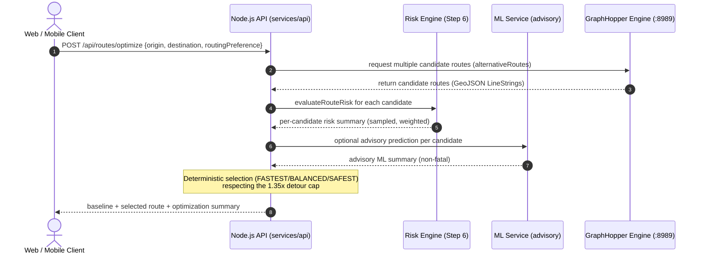

# Routing Engine Spike: GraphHopper for SauraRoute

This document details the routing engine strategy, local test setup, OSM PBF data handling, and the route evaluation workflow for **SauraRoute** (SIH26002).

---

## 1. Objectives of the Spike
1. Validate that standard routing (**Origin → Destination → Route Geometry**) can be executed locally over OpenStreetMap (OSM) data.
2. Formulate the pipeline for extracting the North Eastern Region (NER) road network without processing the entire multi-gigabyte India dataset.
3. Establish how GraphHopper's **Custom Models** will later receive real-time risk scores to alter routing weights (risk-aware routing).

---

## 2. OSM PBF Data Sourcing for the North Eastern Region

### The Challenge
* The official Geofabrik repository provides an `india-latest.osm.pbf` extract (~1.5 GB compressed, ~15+ GB uncompressed in memory). Loading all of India into a local GraphHopper instance requires 8–16 GB of RAM, which is excessive for local development and CI/CD pipelines.
* Geofabrik does not provide a standalone regional extract for North East India.

### Extraction Approaches
To extract only the 8 North Eastern states (Assam, Arunachal Pradesh, Manipur, Meghalaya, Mizoram, Nagaland, Sikkim, Tripura), we have two practical approaches:

#### Approach A: Bounding Box Clipping with Osmium (Local)
1. Download `india-latest.osm.pbf` from [Geofabrik India](https://download.geofabrik.de/asia/india.html).
2. Use the open-source CLI tool `osmium-tool` to clip the geographic bounding box for the NER:
   * **NER Bounding Box Coordinates:** `[min_lon: 88.0, min_lat: 21.5, max_lon: 97.5, max_lat: 29.5]`
3. Command:
   ```bash
   osmium extract --bbox 88.0,21.5,97.5,29.5 india-latest.osm.pbf -o data/raw/ner-roads.osm.pbf
   ```
   *Resulting file size:* ~120 MB to 200 MB (fits easily within memory on any standard development machine).

#### Approach B: Custom Extract via BBBike / HOT Export Tool (Cloud)
* Request an automated polygon extract directly from [BBBike Extract Service](https://extract.bbbike.org/) or the Humanitarian OpenStreetMap Team (HOT) export portal using the NER polygon.

---

## 3. GraphHopper Configuration

GraphHopper runs as a lightweight Java service (or container). Below is the recommended `config.yml` for the local instance:

```yaml
graphhopper:
  datareader.file: data/raw/ner-roads.osm.pbf
  graph.location: data/processed/graphhopper-cache
  
  # Enable elevation if DEM data is attached
  graph.elevation.provider: srtm
  graph.elevation.cache_dir: data/raw/elevation-cache
  
  profiles:
    - name: car
      vehicle: car
      weighting: custom
      custom_model:
        speed:
          - if: "true"
            limit_to: "100"
        priority:
          - if: "road_class == MOTORWAY || road_class == TRUNK || road_class == PRIMARY"
            multiply_by: "1.0"
          - else:
            multiply_by: "0.8"
            
    - name: cargo_truck
      vehicle: roads
      weighting: custom
      custom_model_files: [truck_profile.json]

  profiles_ch: []  # Disable Contraction Hierarchies to allow flexible dynamic risk weighting
  profiles_lm: []

server:
  application_connectors:
    - type: http
      port: 8989
      bind_host: 0.0.0.0
```

---

## 4. How Routing Works at Runtime (Step 8 — implemented)

> [!NOTE]
> The original spike envisioned GraphHopper Custom Model hazard weights (diagram below superseded). The actual Step-8 implementation uses candidate-route optimization as described in Section 6.



---

## 5. Local Validation Procedure (Standard Baseline Route)

To validate the routing engine once the `ner-roads.osm.pbf` file is placed in `data/raw/`:

### 1. Launch GraphHopper Container
```bash
docker run -d \
  --name sauraroute-graphhopper \
  -p 8989:8989 \
  -v $(pwd)/data/raw:/data \
  graphhopper/graphhopper:latest \
  -Ddw.graphhopper.datareader.file=/data/ner-roads.osm.pbf
```

### 2. Execute Test Query (Guwahati → Shillong corridor)
* **Origin (Guwahati):** `lat: 26.1445, lon: 91.7362`
* **Destination (Shillong):** `lat: 25.5788, lon: 91.8933`

```bash
curl "http://localhost:8989/route?point=26.1445,91.7362&point=25.5788,91.8933&profile=car&points_encoded=false"
```

### 3. Expected Output Schema
```json
{
  "hints": {
    "visited_nodes.sum": 1240,
    "visited_nodes.average": 1240.0
  },
  "paths": [
    {
      "distance": 98450.2,
      "weight": 5890.1,
      "time": 7200000,
      "transfers": 0,
      "points_encoded": false,
      "bbox": [91.7362, 25.5788, 91.8933, 26.1445],
      "points": {
        "type": "LineString",
        "coordinates": [
          [91.7362, 26.1445],
          [91.7821, 25.9810],
          [91.8933, 25.5788]
        ]
      },
      "instructions": [
        {
          "distance": 1200.0,
          "heading": 135.0,
          "sign": 0,
          "interval": [0, 2],
          "text": "Continue onto GS Road (NH-40)",
          "time": 90000,
          "street_name": "GS Road"
        }
      ]
    }
  ]
}
```

---

## 6. Implemented Step-8 Approach: Candidate-Route Optimization

> [!NOTE]
> Step 8 was implemented using **candidate-route optimization** (Approach B), not the edge-level Custom Model hazard weighting described below. The GraphHopper graph's edge weights are **not** modified at runtime. Instead, several alternative candidate routes are returned by GraphHopper, each is profiled with the Step-6 risk engine, and a deterministic selector chooses the safest route within the configured detour budget.

Pipeline:

```
GraphHopper candidate routes
        ↓
Candidate normalization (GeoJSON [lon, lat])
        ↓
Request-scoped risk profiling (Step-6 risk engine)
        ↓
Optional advisory ML prediction (non-fatal)
        ↓
Deterministic route selection (FASTEST / BALANCED / SAFEST)
        ↓
POST /api/routes/optimize  →  baseline + selected route
```

* **FASTEST** selects the fastest candidate.
* **BALANCED** combines normalized travel cost and hazard exposure.
* **SAFEST** prioritizes a materially lower hazard while honoring the `1.35` detour cap.
* Risk exposure uses the Step-6 aggregation: `0.6 × maxSampledRisk + 0.4 × meanSampledRisk`.
* Critical active-incident candidates are excluded when a valid non-critical alternative exists.
* Selection is fully deterministic; ML is advisory only and never overrides the selector.

## 6.1 Dynamic Rerouting (Step 8)

`POST /api/routes/reroute` re-evaluates a supplied current route against freshly acquired candidates using the same acquire → profile → compare pipeline.

Recommendation criteria (from `optimization.config.ts`):

* The current route is eligible when it has an active CRITICAL incident **or** its hazard exposure is ≥ `rerouting.triggerScore` (50.0).
* A reroute is recommended only when a detour-eligible alternative has lower hazard and provides at least `rerouting.minRerouteImprovement` (0.15 → 15%) hazard reduction within the `1.35` detour cap.
* When safety intelligence is `DEGRADED` (any risk could not be fully evaluated), rerouting is reported as **not recommended** with an honest reason, rather than guessing.
* Rerouting is an explicitly triggered evaluation in the current UI; it is **not** a continuous polling loop.

## 7. Future Risk-Aware Extension (not yet implemented)
GraphHopper Custom Models support dynamic area penalties via the `areas` object (this is the alternative edge-weighting direction, distinct from the candidate-route approach that Step 8 actually ships):
```json
{
  "priority": [
    {
      "if": "in_area_landslide_warning",
      "multiply_by": "0.1"
    }
  ],
  "areas": {
    "in_area_landslide_warning": {
      "type": "Feature",
      "geometry": {
        "type": "Polygon",
        "coordinates": [[[91.80, 25.80], [91.85, 25.80], [91.85, 25.85], [91.80, 25.85], [91.80, 25.80]]]
      }
    }
  }
}
```
This enables the router to naturally detour cargo vehicles around active landslide warnings or flood-submerged passes without breaking baseline routing connectivity.

---

## 8. Current Limitations & Honesty

SauraRoute is a **decision-support prototype**, not a real-world safety certification. When presenting the platform, be explicit about the following limitations:

* **Sampled, not per-edge risk.** Risk is evaluated at waypoints sampled approximately every **5 km** along each candidate corridor (max-sampled and mean). It is not assigned to every road-graph edge, so short or highly localized hazards between sample points can be missed.
* **Candidate evaluation cost.** Profiling multiple candidates requires a risk lookup per sampled waypoint per candidate, so `maxPaths > 3` makes evaluation increasingly expensive.
* **Snapshot semantics.** Weather and active-incident inputs are a point-in-time snapshot at evaluation; they can change immediately after a request.
* **Sparse alternative routes.** NER corridors (e.g. Guwahati → Shillong, Shillong → Cherrapunji) may yield only one or a few GraphHopper alternative routes; the optimizer then honestly selects the baseline rather than inventing a safer detour.
* **Advisory ML only.** The ML model uses a synthetic/demo dataset (40 balanced samples) and proxy terrain features; it is not a production-trained regional generalization, and its predictions never override the Step-6 risk engine or selector. ML failures are non-fatal.
* **Data availability.** Public/government historical, weather, and road-incident data coverage varies across the NER, so risk scoring fidelity is uneven by corridor.
